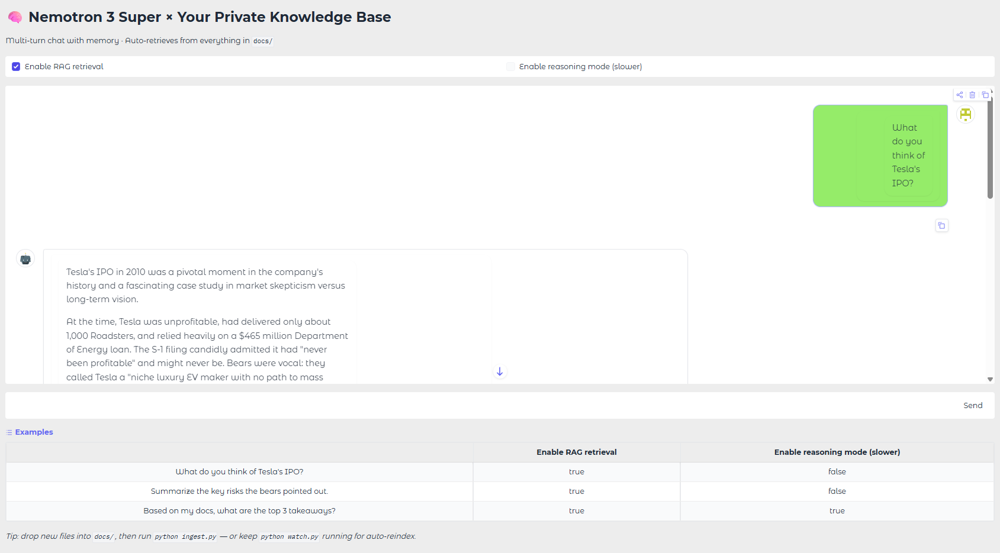

# 🧠 Nemotron-RAG

> A zero-config, privacy-first RAG chatbot powered by **NVIDIA Nemotron 3 Super 120B**.
> Drop your docs into a folder. Chat with them in your browser. Your data stays local.



## 🎯 What is this?

A **downloadable desktop-style** chatbot that lets you query your own documents
(PDFs, Word files, Markdown, code, JSON) using one of the strongest open-weight LLMs
available — **NVIDIA's Nemotron 3 Super 120B** — via their free API at
[build.nvidia.com](https://build.nvidia.com).

No accounts. No cloud uploads. No docker. Just a Python venv, a Gradio UI, and your files.

## ⚡ Quick Start (End Users)

Grab the latest release:

```
Releases → Nemotron-RAG.zip → extract → double-click Start.bat (or Start.command)
```

> **Windows "Unknown Publisher" warning is expected.** The launcher isn't
> code-signed. Click **Run** to proceed, or right-click `Start.bat` → Properties →
> **Unblock** to silence it permanently. The script is plain text — inspect it in
> Notepad first if you want to verify it's safe.

On first launch the script:
1. Creates a virtual environment
2. Installs dependencies (~3–5 min)
3. Prompts for your NVIDIA API key (get one free at [build.nvidia.com](https://build.nvidia.com))
4. Ingests whatever is in `docs/` into ChromaDB (**one-time**, only if `chroma_db/` doesn't exist)
5. Opens the chat UI in your browser

**Adding documents later?** Start.bat does NOT auto-reindex on subsequent runs.
Either run `python rag/ingest.py` manually, or keep `python rag/watch.py` running in a
second terminal for live re-indexing.

See the [user guide](dist/README.md) for details.

## 🛠️ For Developers

```bash
git clone <this-repo>
cd nemotron-rag
python -m venv .venv
source .venv/bin/activate     # on Windows: .venv\Scripts\activate
pip install -r requirements.txt
echo "NVIDIA_API_KEY=nvapi-..." > .env

# drop files into docs/, then:
python rag/ingest.py
python rag/app.py              # web UI
# or
python rag/query.py "your question here"
```

### Project Layout

```
.
├── rag/
│   ├── app.py          # Gradio web UI (multi-turn, cites sources)
│   ├── ingest.py       # chunks + embeds → ChromaDB
│   ├── query.py        # one-shot CLI query
│   ├── watch.py        # auto re-index on file change
│   └── embedder.py     # NVIDIA nv-embedqa-e5-v5 wrapper
├── chat.py             # terminal-only chat (no RAG)
├── test_nemotron.py    # API smoke test
├── build_portable.py   # packages dist/Nemotron-RAG.zip
├── docs/               # your documents (gitignored)
├── chroma_db/          # vector store (gitignored)
└── dist/               # portable distribution
```

## 🧰 Tech Stack

| Layer | Choice | Why |
|-------|--------|-----|
| LLM | Nemotron 3 Super 120B (NVIDIA) | Strong open-weight model, free API tier |
| Embeddings | `nv-embedqa-e5-v5` (NVIDIA) | 512-token, QA-optimized |
| Vector DB | ChromaDB (persistent local) | Zero-config, pure Python |
| UI | Gradio 6.x | Instant web UI, streaming support |
| File watcher | `watchdog` | Cross-platform auto re-index |

## 🔐 Privacy Model

| Stays local | Goes over the wire |
|-------------|--------------------|
| Raw documents | Embedding text (chunks) → NVIDIA API |
| ChromaDB (vectors) | Your prompts + retrieved context → NVIDIA API |
| `.env` (API key) | (responses stream back) |

To fully wipe: delete `docs/`, `chroma_db/`, `.env`. Revoke the key at build.nvidia.com.

## 🤝 Contributing

See [CONTRIBUTING.md](CONTRIBUTING.md).

## 📜 License

MIT — see [LICENSE](LICENSE).

## 🙏 Acknowledgments

Built after seeing NVIDIA's "Agentic AI 101" / OpenClaw session at **GTC 2026**.
Shoutout to the NVIDIA team for shipping Nemotron 3 Super openly and for the clean API.
